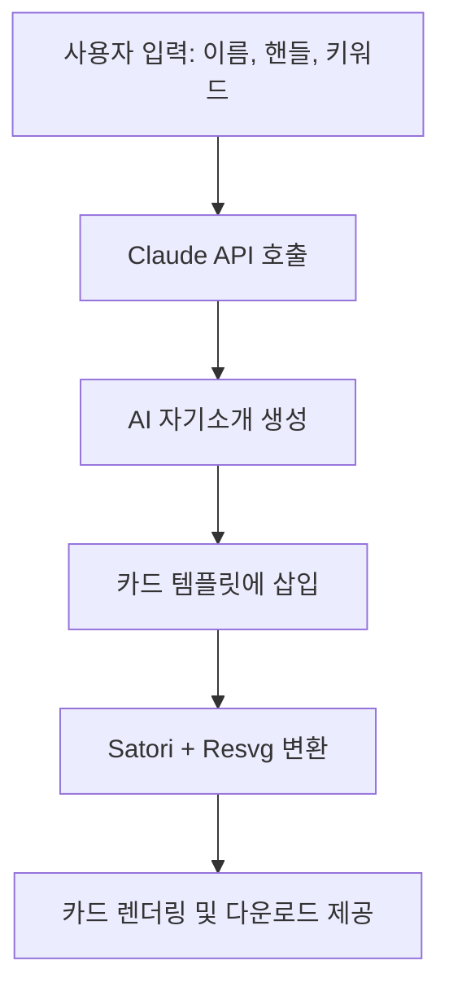

# Insta-Style 소개팅 프로필 카드 생성기 – Cloudflare 기반 PRD

## 1. 프로젝트 개요

| 항목 | 내용 |
|------|------|
| 프로젝트명 | Insta-Style 소개팅 프로필 카드 |
| 목적 | 사용자가 이름, 인스타 계정, 키워드를 입력하면 Claude(OpenAI-compatible)를 통해 소개글을 자동 생성하고, 인스타 감성 카드 스타일로 시각화하여 PNG로 다운로드 가능 |
| 플랫폼 | 100% Cloudflare 기반 (Pages + Functions + D1 + AI Gateway) |
| 대상 | 10–30대 MZ세대, 소개팅 앱/인스타 사용자, 비개발자 타겟 |
| 핵심 가치 | 즉시성 · 감성 디자인 · AI 맞춤형 자기소개 · 공유 가능 |

---

## 2. 성공 지표 (SMART)

| 목표 | 지표 | 기준 |
|------|------|------|
| 전환 | 프로필 카드 생성 클릭률 | ≥ 70 % |
| 사용성 | 다운로드까지 완료율 | ≥ 60 % |
| 퍼포먼스 | P95 카드 렌더링 시간 | ≤ 5초 |
| 확산성 | QR 코드 스캔 통한 접속수 | ≥ 50 명 |

---

## 3. 주요 기능 요구 사항

| 코드 | 기능 | 설명 |
|------|------|------|
| F-1 | 사용자 입력 폼 | 이름, 인스타 핸들, 키워드 입력 |
| F-2 | AI 자기소개 생성 | Claude API 호출 (`/chat/completions`) |
| F-3 | 카드 디자인 렌더링 | Satori (SVG) + Resvg (PNG) |
| F-4 | D1 저장 | 생성된 데이터 기록 (id 기준 조회) |
| F-5 | 다운로드 링크 | 카드 이미지 다운로드 제공 |
| F-6 | QR 공유 (옵션) | 공유 링크 및 QR 생성 제공 |

---

## 4. 사용자 플로우 (UX Flow)



---

## 5. 입력 UI 구성 (v0 및 React 기준)

| 필드 | 유형 | 예시 |
|------|------|------|
| 이름 | `text` | "김지수" |
| 인스타 핸들 | `text` | "@luv_jisu" |
| 키워드 | `text` | "ENFP, 감성사진, 산책, 여행" |
| 버튼 | `submit` | "AI로 프로필 만들기" |

**Tailwind 기반 UI 예시:**

```tsx
<form className="max-w-md mx-auto p-4 bg-white rounded-xl shadow">
  <h2 className="text-xl font-bold text-center mb-4">나만의 소개팅 프로필 만들기</h2>
  <input type="text" name="name" className="..." placeholder="이름" />
  <input type="text" name="handle" className="..." placeholder="@your_instagram" />
  <input type="text" name="keywords" className="..." placeholder="키워드 입력" />
  <button type="submit" className="...">AI로 카드 만들기</button>
</form>
```

---

## 6. 결과 카드 구성 (출력 UI)

- 원형 프로필 이미지 (기본 이미지 또는 업로드 가능)
- 이름 + 나이 (또는 핸들)
- Claude가 생성한 소개글
- 해시태그 칩 스타일 키워드
- PNG 다운로드 링크 or 버튼
- QR 코드 카드 (선택)

**카드 Tailwind 예시:**

```tsx
<div className="bg-white rounded-3xl p-6 shadow-lg w-full max-w-sm mx-auto text-center">
  
  <h3 className="text-lg font-bold">김지수</h3>
  <p className="text-gray-500">@luv_jisu</p>
  <p className="mt-3">혼밥보다는 함께 있는 시간이 좋아요...</p>
  <div className="flex flex-wrap justify-center mt-4 gap-2">
    <span className="...">#ENFP</span>
    <span className="...">#카페</span>
  </div>
  <a href="/download/card.png" className="...">카드 다운로드</a>
</div>
```

---

## 7. v0 Prompt 예시 (입력 + 결과 카드 디자인용)

```
Create a mobile-first dating profile generator UI in two steps.
First: input form with name, instagram handle, and keyword fields, and a 'Create Profile' button.
Second: output card in Instagram style, with pastel gradient background, rounded corners, large circular avatar, bold name + age, one-line AI-generated self-intro, hashtag chips (e.g., #여행 #고양이 #감성카페), and a download link at bottom.
Use Korean-friendly sans-serif fonts and responsive layout.
```

---

## 8. 기술 스택

| 영역 | 기술 |
|------|------|
| 프론트엔드 | v0.dev → Next.js + Tailwind CSS |
| 서버리스 API | Cloudflare Pages Functions (TypeScript) |
| AI 연동 | Claude API (OpenAI-compatible) via AI Gateway |
| DB | Cloudflare D1 (SQLite 기반) |
| 이미지 생성 | Satori (SVG) + Resvg (PNG) |
| 배포 | Cloudflare Pages (GitHub 또는 wrangler) |

---

## 9. 배포 플로우 (로컬 or GitHub 연동)

1. Claude Code → v0 UI + Functions 생성
2. wrangler.toml 설정
3. D1 초기화 (`wrangler d1 create` + schema.sql)
4. 배포: `npx wrangler pages deploy`

---

## 10. 일정 예시

| 주차 | 내용 |
|------|------|
| 1주차 | UI 시안 (v0), 입력폼 구조 확정 |
| 2주차 | Claude 연동 함수 완성 |
| 3주차 | 카드 렌더링 및 이미지 변환 구현 |
| 4주차 | 배포 및 발표용 QR, 테스트 |

---

## ✅ 마무리

이 PRD는 10–30대가 직접 참여하고 공유하고 싶어지는 감성 중심의 AI 소개팅 카드 생성기를 목표로 합니다.  
모든 스택은 Cloudflare 무료 범위 내 구현 가능하며, 발표나 데모에 최적화되어 있습니다.